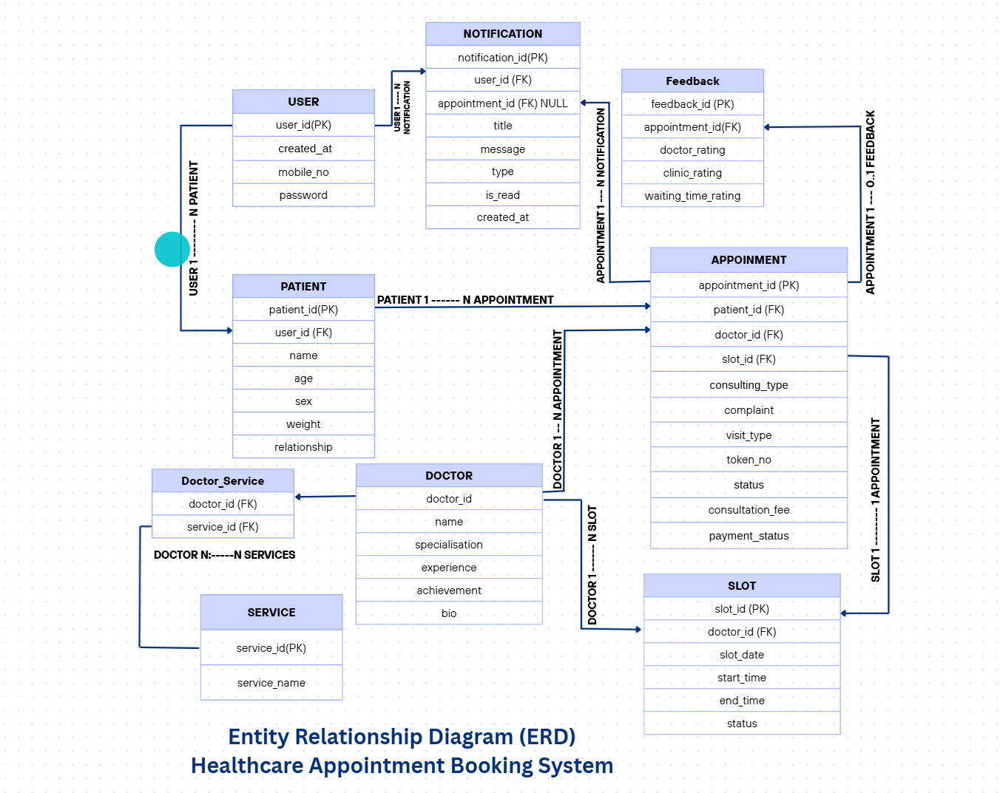

# Schedula – Backend Internship Day 1

## Overview

Day 1 submission for the Schedula Backend Internship Program.

### Completed Tasks

✅ NestJS project setup

✅ Application running successfully on localhost

✅ Wireframe analysis

✅ Entity Relationship Diagram (ERD) design

---

## Tech Stack

- NestJS
- TypeScript
- PostgreSQL
- Git & GitHub

---

## ER Diagram

The ER Diagram is available in:

`docs-er diagram/Screenshot 2026-06-04 185317.png`

---

## Key Entities

- User
- Patient
- Doctor
- Service
- Doctor_Service
- Slot
- Appointment
- Feedback
- Notification

---

## Repository

This repository contains the NestJS project setup and the database design derived from the provided Schedula wireframes.
