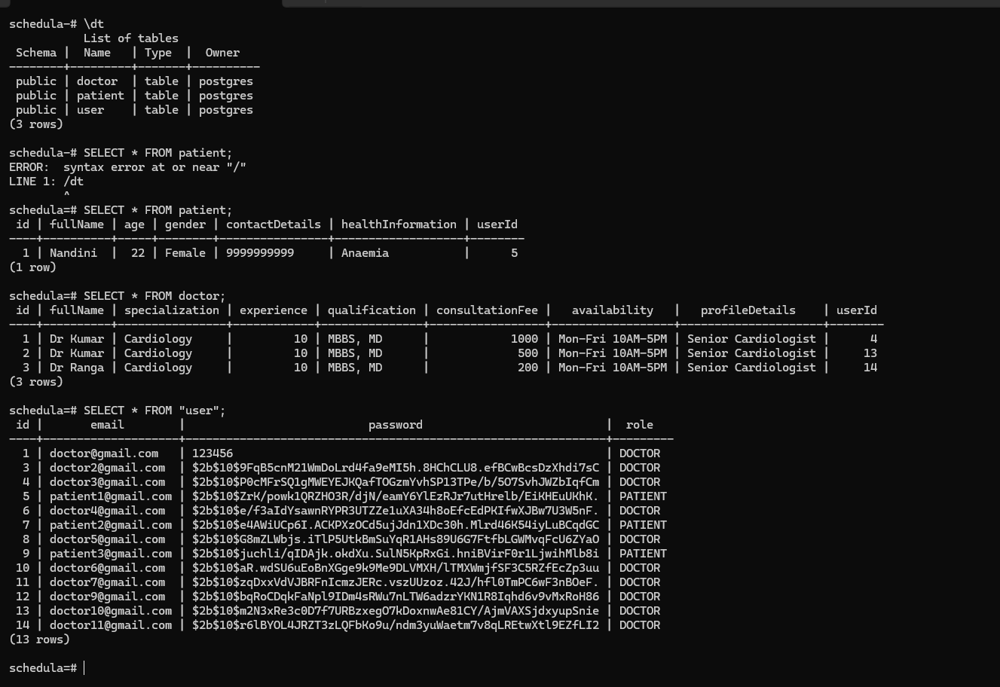

# 🔐 Doctor & Patient Onboarding

Day 3 Backend Internship Task

## ⚙️ Tech Stack

NestJS • TypeORM • PostgreSQL (Docker) • JWT • bcrypt • Class Validator

---

## 🎥 Demo & API Testing

* 🎥 Loom Video: https://www.loom.com/share/8d1e25bff54f46c686970ecfd808923b

---

## 🚀 Features

### Doctor Onboarding

* POST `/doctor/profile`
* GET `/doctor/profile`
* PATCH `/doctor/profile`

### Patient Onboarding

* POST `/patient/profile`
* GET `/patient/profile`
* PATCH `/patient/profile`

### Security

* JWT Authentication
* Role-Based Authorization (DOCTOR / PATIENT)
* Password Hashing using bcrypt
* PostgreSQL running in Docker container

---

## 🏗️ Database Design

* User ↔ Doctor Profile (One-to-One)
* User ↔ Patient Profile (One-to-One)

### Entities

* User
* Doctor
* Patient

---

## 🛡️ Edge Cases Handled

* Prevent duplicate profile creation (`409 Conflict`)
* Return `404 Not Found` when profile is not found
* Restrict Doctor access to Patient APIs (`403 Forbidden`)
* Restrict Patient access to Doctor APIs (`403 Forbidden`)
* Validate required fields using DTOs
* Handle invalid request payloads (`400 Bad Request`)
* Prevent updates to restricted fields (`id`, `user`, `role`)

---

## 📸 API Testing

### Role-Based Protection

All API testing screenshots are available in the `postman_ss` folder.
