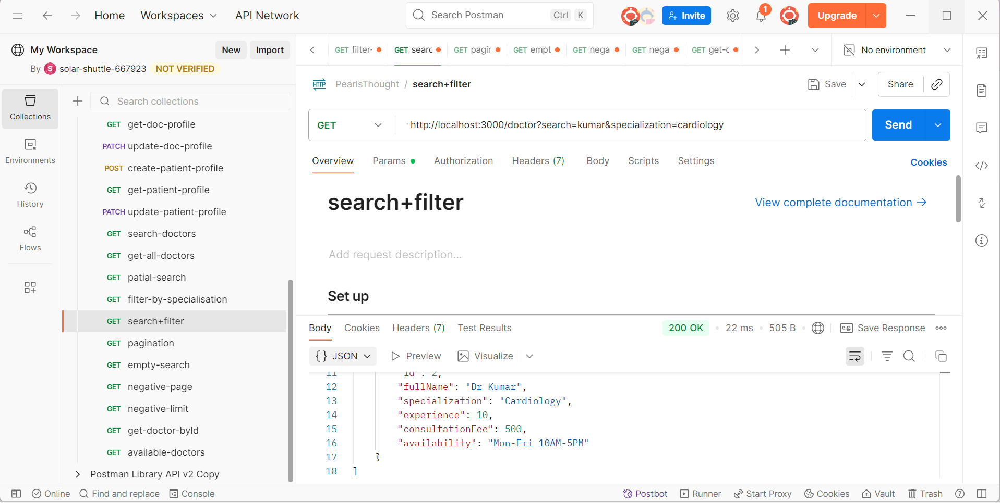

# 🩺 Doctor Discovery APIs

Day 4 Backend Internship Task

## 🎥 Demo

Loom Video: https://www.loom.com/share/05dc329867ba4c16a501bc59235d9a95

---

## ⚙️ Tech Stack

NestJS • TypeORM • PostgreSQL (Docker) • JWT • Class Validator

---

## 🚀 APIs Implemented

### Fetch Doctors

```http
GET /doctor
```

Returns doctor listing with:

* Doctor ID
* Full Name
* Specialization
* Experience
* Consultation Fee
* Availability

### Search Doctors

```http
GET /doctor?search=rahul
```

Implemented using TypeORM QueryBuilder with case-insensitive partial matching.

### Filter by Specialization

```http
GET /doctor?specialization=cardiology
```

Filters doctors by specialization.

### Pagination

```http
GET /doctor?page=1&limit=10
```

Implemented using:

* `skip()`
* `take()`

Default values:

* page = 1
* limit = 10

### Doctor Details

```http
GET /doctor/:id
```

Returns complete doctor profile information.

### Availability Filter (Bonus)

```http
GET /doctor?availability=true
```

Returns doctors having configured consultation availability.

---

## 🏗️ Implementation Details

### Dynamic Filtering with QueryBuilder

Doctor listing API supports combining multiple filters:

```http
GET /doctor?search=rahul&specialization=cardiology&page=1&limit=10
```

Implemented using TypeORM QueryBuilder with conditional `andWhere()` clauses.

### Optimized Response

Only required fields are selected for doctor listing:

* id,fullName,specialization,experience,consultaionFee,availability

### Pagination Logic

Records are paginated using:

```ts
skip((page - 1) * limit)
take(limit)
```

### Doctor Details Lookup

Implemented dedicated doctor lookup by ID using:

```ts
findOne({ where: { id } })
```

---

## 🛡️ Edge Cases Handled

* Duplicate filters combined correctly
* No doctors found → 404 Not Found
* Invalid doctor ID → 404 Not Found
* Empty search result → 404 Not Found
* Negative page value → 400 Bad Request
* Negative limit value → 400 Bad Request
* Missing query parameters handled with defaults
* Case-insensitive search and specialization filtering

---

## 📸 API Testing

### Doctor Discovery APIs



All APIs and edge cases were tested successfully using Postman.
